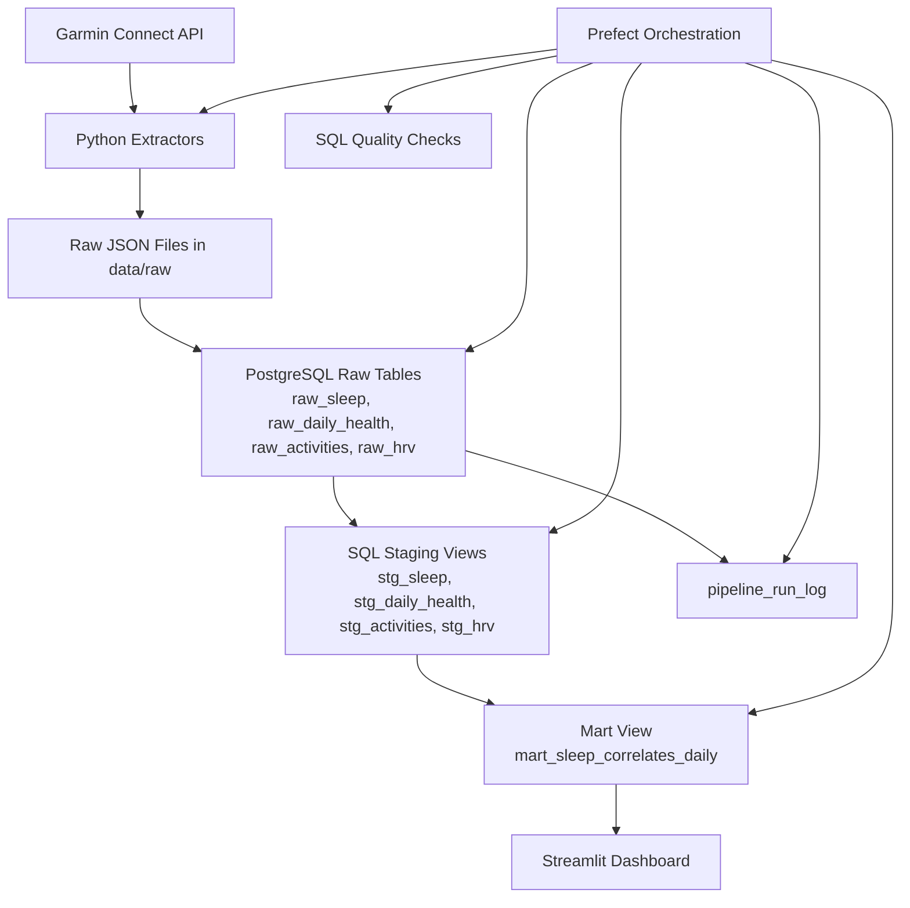
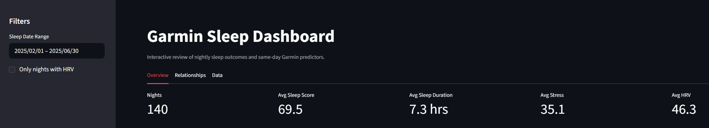
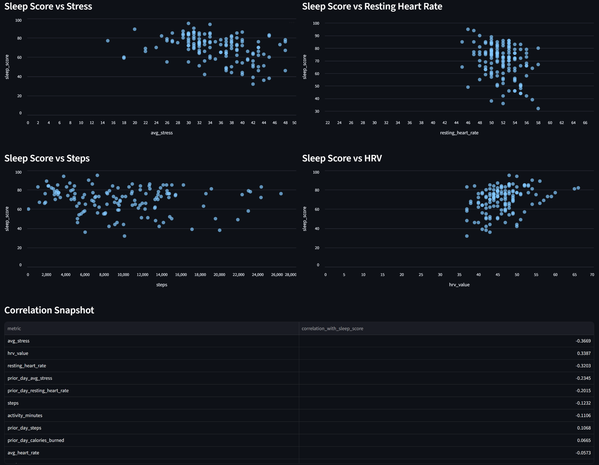
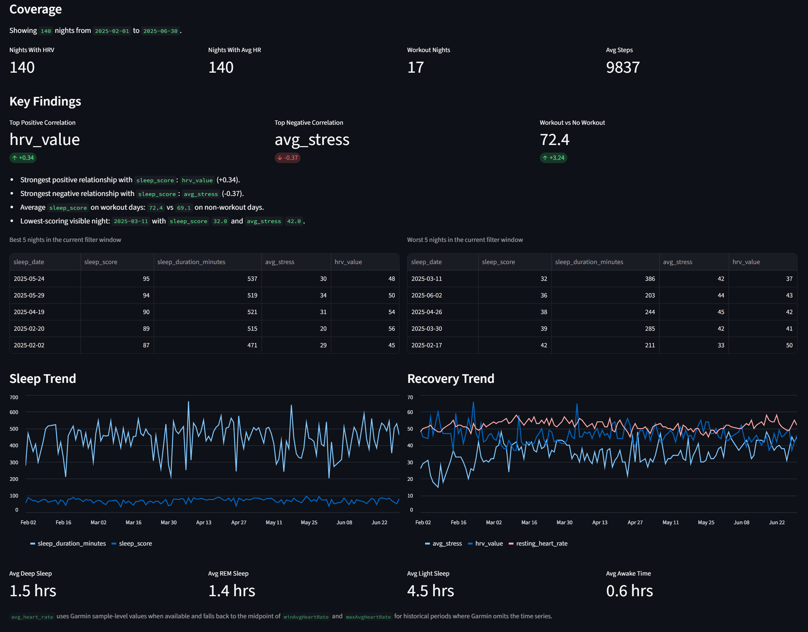

# Garmin Data Pipeline

Garmin-only sleep analytics proof of concept built with Python, PostgreSQL, SQL views, and Streamlit.

The pipeline:

1. extracts Garmin data with Python,
2. stores raw API responses as JSON,
3. loads raw JSON into PostgreSQL,
4. builds staging and mart views with SQL,
5. serves a dashboard from `mart_sleep_correlates_daily`.

## Architecture



The orchestrated workflow runs extraction, raw loading, SQL refreshes, and quality checks as a single local pipeline while preserving raw files for traceability and safe reruns.

## Current Status

The implemented workflow now supports:

- Garmin login and extraction using your own account
- raw JSON persistence under `data/raw/`
- raw-table loading into PostgreSQL
- staging views for sleep, daily health, activities, and HRV
- an analysis-ready mart called `mart_sleep_correlates_daily`
- a working Streamlit dashboard backed by the mart

## Stack

- Python 3.14
- native PostgreSQL 17
- `garminconnect`
- `psycopg`
- plain SQL views
- Prefect
- Streamlit

## Project Layout

```text
garmin_data_pipeline/
├── app/
│   ├── extract/
│   ├── load/
│   ├── orchestration/
│   ├── transform/
│   ├── utils/
│   └── main.py
├── dashboards/
│   └── streamlit_app.py
├── data/
│   └── raw/
├── sql/
│   ├── ddl/
│   ├── staging/
│   ├── tests/
│   └── marts/
├── tests/
├── .env.example
├── README.md
└── requirements.txt
```

## Environment Setup

1. Create and activate a virtual environment.

```powershell
python -m venv .venv
& .\.venv\Scripts\Activate.ps1
```

2. Install dependencies.

```powershell
& .\.venv\Scripts\python.exe -m pip install -r requirements.txt
```

3. Copy `.env.example` to `.env` and fill in your Garmin and PostgreSQL credentials.

Required settings:

- `GARMIN_EMAIL`
- `GARMIN_PASSWORD`
- `GARMIN_MFA_CODE`
- `POSTGRES_HOST`
- `POSTGRES_PORT`
- `POSTGRES_DB`
- `POSTGRES_USER`
- `POSTGRES_PASSWORD`

Important notes:

- Leave `GARMIN_DISABLE_ENV_PROXY=true` if your shell or machine sets proxy environment variables.
- If Garmin MFA is enabled, refresh `GARMIN_MFA_CODE` before running login or extraction commands.
- This project is currently documented for native PostgreSQL. `docker-compose.yml` exists, but the validated workflow in this repo uses native Postgres.

## PostgreSQL Setup

Create the raw tables:

```powershell
& .\.venv\Scripts\python.exe -m app.main run-sql --file sql/ddl/001_raw_tables.sql
```

If you want to clear previously loaded raw rows before a backfill:

```powershell
& .\.venv\Scripts\python.exe -m app.main run-sql --file sql/ddl/002_truncate_raw_tables.sql
```

## CLI Commands

The main entry point is `app.main`.

Available commands:

- `bootstrap`
- `login-test`
- `extract-recent`
- `extract-range`
- `run-pipeline-recent`
- `run-pipeline-range`
- `load-raw`
- `run-sql`
- `run-quality-checks`

### Test Garmin Login

```powershell
& .\.venv\Scripts\python.exe -m app.main login-test
```

### Extract Recent Data

```powershell
& .\.venv\Scripts\python.exe -m app.main extract-recent --days 7
```

Skip HRV if needed:

```powershell
& .\.venv\Scripts\python.exe -m app.main extract-recent --days 7 --skip-hrv
```

### Extract a Specific Date Range

```powershell
& .\.venv\Scripts\python.exe -m app.main extract-range --start-date 2025-03-01 --end-date 2025-06-30
```

Large historical pulls are safer month by month:

```powershell
& .\.venv\Scripts\python.exe -m app.main extract-range --start-date 2025-03-01 --end-date 2025-03-31
& .\.venv\Scripts\python.exe -m app.main extract-range --start-date 2025-04-01 --end-date 2025-04-30
& .\.venv\Scripts\python.exe -m app.main extract-range --start-date 2025-05-01 --end-date 2025-05-31
& .\.venv\Scripts\python.exe -m app.main extract-range --start-date 2025-06-01 --end-date 2025-06-30
```

### Run the Full Prefect Pipeline for Recent Data

```powershell
& .\.venv\Scripts\python.exe -m app.main run-pipeline-recent --days 7
```

Skip HRV if needed:

```powershell
& .\.venv\Scripts\python.exe -m app.main run-pipeline-recent --days 7 --skip-hrv
```

### Run the Full Prefect Pipeline for an Explicit Date Range

```powershell
& .\.venv\Scripts\python.exe -m app.main run-pipeline-range --start-date 2025-06-01 --end-date 2025-06-30
```

These orchestrated commands run:

1. Garmin extraction
2. raw JSON load into PostgreSQL
3. staging SQL refresh
4. mart SQL refresh
5. SQL quality checks

Important:

- Disable your VPN before Garmin authentication or extraction.
- Refresh `GARMIN_MFA_CODE` before orchestrated runs if MFA is enabled.
- The Prefect flow runs locally inside the CLI command for now, which keeps setup simple while still giving you an orchestration layer.

### Load Raw JSON into PostgreSQL

Load everything:

```powershell
& .\.venv\Scripts\python.exe -m app.main load-raw --dataset all
```

Or load a single dataset:

```powershell
& .\.venv\Scripts\python.exe -m app.main load-raw --dataset sleep
```

The raw load step is idempotent by design:

- records are keyed by `source_file`
- reruns safely upsert with `ON CONFLICT (source_file) DO UPDATE`
- repeated loads refresh the stored payload and `fetched_at` timestamp instead of creating duplicates

## SQL Models

Raw tables:

- `raw_sleep`
- `raw_daily_health`
- `raw_activities`
- `raw_hrv`

Operational tables:

- `pipeline_run_log`

Staging views:

- `stg_sleep`
- `stg_daily_health`
- `stg_activities`
- `stg_hrv`

Mart view:

- `mart_sleep_correlates_daily`

### Build or Refresh Staging Views

```powershell
& .\.venv\Scripts\python.exe -m app.main run-sql --file sql/staging/001_stg_sleep.sql
& .\.venv\Scripts\python.exe -m app.main run-sql --file sql/staging/002_stg_daily_health.sql
& .\.venv\Scripts\python.exe -m app.main run-sql --file sql/staging/003_stg_activities.sql
& .\.venv\Scripts\python.exe -m app.main run-sql --file sql/staging/004_stg_hrv.sql
```

### Build or Refresh the Mart

```powershell
& .\.venv\Scripts\python.exe -m app.main run-sql --file sql/marts/001_mart_sleep_correlates_daily.sql
```

### Run SQL Quality Checks

Run all SQL assertions in `sql/tests/`:

```powershell
& .\.venv\Scripts\python.exe -m app.main run-quality-checks
```

Current quality checks validate:

- no null `sleep_score` or `sleep_duration_minutes` in `mart_sleep_correlates_daily`
- no duplicate `sleep_date` rows in the mart
- no impossible sleep duration values
- no negative steps, calories, or activity minutes
- no extreme HRV values outside a conservative expected range

## Pipeline Run Logging

The pipeline now tracks operational runs in `pipeline_run_log`.

Logged steps currently include:

- `load-raw`
- `run-sql`
- `run-quality-checks`
- `run-pipeline-recent`
- `run-pipeline-range`

Each log row records:

- a unique `run_id`
- `pipeline_name`
- `status` as `started`, `success`, or `failed`
- `started_at` and `finished_at`
- JSON `details` such as dataset, file path, or files loaded
- `error_message` when a run fails

If the table has not been created yet, the CLI continues to run and emits a warning instead of blocking the pipeline. To create the table, rerun:

```powershell
& .\.venv\Scripts\python.exe -m app.main run-sql --file sql/ddl/001_raw_tables.sql
```

The mart currently:

- keeps one row per sleep night
- joins same-day Garmin predictors
- includes lagged `prior_day_*` fields
- excludes incomplete nights where `sleep_score` or `sleep_duration_minutes` is null

## Tests

Run the Python unit test suite:

```powershell
& .\.venv\Scripts\python.exe -m pytest
```

The current suite covers:

- config loading defaults and environment overrides
- date range validation for extraction helpers
- raw JSON directory creation and file writing
- loader validation and upsert query behavior
- Prefect orchestration sequencing and argument wiring
- SQL directory execution ordering for quality checks

## Dashboard

Start Streamlit:

```powershell
& .\.venv\Scripts\python.exe -m streamlit run dashboards/streamlit_app.py --server.port 8501
```

Then open:

- [http://localhost:8501](http://localhost:8501)

The dashboard includes:

- date filters
- key sleep and recovery KPIs
- sleep and recovery trend charts
- scatterplots for stress, steps, heart rate, and HRV
- a correlation summary against `sleep_score`
- recent-row and data-quality tables

## Key Findings

The current Streamlit analysis is based on 140 analysis-ready nights from 2025-02-01 through 2025-06-30.

- Stress shows the strongest same-day negative relationship with `sleep_score` at `-0.367`.
- HRV shows the strongest positive relationship with `sleep_score` at `0.339`.
- Resting heart rate is also meaningfully negative at `-0.320`, which lines up with worse recovery nights tending to score lower.
- Prior-day signals are weaker than same-day signals in this sample. The largest lagged relationships are `prior_day_avg_stress` at `-0.234` and `prior_day_resting_heart_rate` at `-0.201`.
- Workout days have a slightly higher average sleep score than non-workout days: `72.4` vs `69.1`.
- Workout days in this slice also have shorter average sleep duration than non-workout days: `414.8` minutes vs `444.6` minutes.
- The best night in the sample was `2025-05-24` with sleep score `95`, `537` minutes of sleep, average stress `30`, and HRV `48`.
- The worst night in the sample was `2025-03-11` with sleep score `32`, `386` minutes of sleep, average stress `42`, and HRV `37`.

These are observational relationships from one personal dataset, so they are useful for directional insight but should not be treated as causal conclusions.

### Dashboard Screenshots

The screenshots below use the same `2025-02-01` to `2025-06-30` filter window as the findings summary above.



Top-level dashboard view showing coverage, KPI cards, and the active analysis window.



Relationship view highlighting the strongest visual signals between `sleep_score`, stress, HRV, and resting heart rate.



Detail view showing the standout nights and the supporting tables behind the summary findings.

## Notebook Analysis

The repo also includes a reproducible analysis notebook at `notebooks/sleep_analysis.ipynb`.

It reads from `mart_sleep_correlates_daily` using the same `.env` PostgreSQL settings as the CLI and Streamlit dashboard, and walks through:

- coverage and descriptive statistics
- missingness review
- `sleep_score` correlation summary
- same-day vs lagged comparisons
- workout vs non-workout comparisons
- best and worst nights in the selected window
- a short written summary of findings

## Validation Queries

Useful checks in `psql`:

```sql
select count(*) from raw_sleep;
select count(*) from raw_daily_health;
select count(*) from raw_activities;
select count(*) from raw_hrv;
```

```sql
select
    pipeline_name,
    status,
    started_at,
    finished_at,
    details,
    error_message
from pipeline_run_log
order by started_at desc
limit 20;
```

```sql
select
    sleep_date,
    sleep_score,
    sleep_duration_minutes,
    avg_stress,
    steps,
    avg_heart_rate,
    resting_heart_rate,
    workout_count,
    hrv_value
from mart_sleep_correlates_daily
order by sleep_date desc
limit 20;
```

## Data Notes

- Garmin payloads can be null-heavy for incomplete or in-progress days.
- The mart excludes incomplete nights by default.
- Historical Garmin daily-health payloads may not include `heartRateValues`.
- In those cases, `stg_daily_health.avg_heart_rate` falls back to the midpoint of `minAvgHeartRate` and `maxAvgHeartRate`.
- Activity data is extracted as range-based JSON and then normalized to one row per day in `stg_activities`.

## Typical Workflow

For a new backfill or refresh:

1. Update `.env` with the latest Garmin MFA code if needed.
2. Run `login-test` if you want to verify authentication first.
3. Extract a recent or explicit date range.
4. Load raw JSON into PostgreSQL.
5. Refresh staging SQL files.
6. Refresh the mart SQL file.
7. Run SQL quality checks.
8. Start Streamlit and review the dashboard.

## Next Improvements

Good follow-up tasks:

- add a notebook for exploratory analysis
- add weekday and rolling-average dashboard views
- add deeper comparisons for workout vs non-workout and lagged recovery signals
